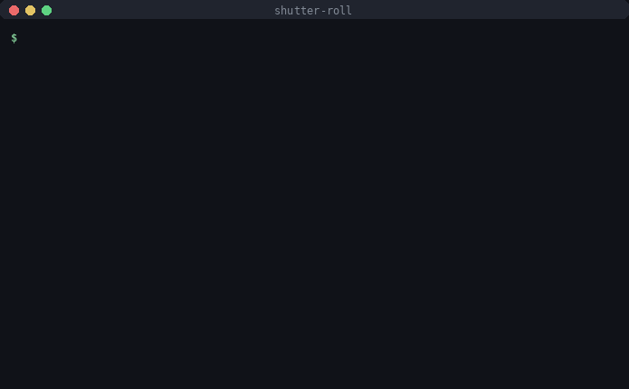

# shutter-roll

[](https://github.com/keivanmalhani/shutter-roll/actions/workflows/ci.yml)




Put the shooting story back into scanned film. Scans come home with no film stock, no camera, no ISO, and the scan date sitting where the shoot date belongs, so Lightroom files your July roll under October. shutter-roll takes a folder of scans from one roll plus a six-line description and injects the real metadata into every frame, then renders a contact sheet. Local only, backups by default.

## Quick start

Requires Python 3.11+ and [exiftool](https://exiftool.org).

```bash
brew install exiftool          # macOS
```

```bash
pip install git+https://github.com/keivanmalhani/shutter-roll.git
```

Describe the roll once:

```bash
shutter-roll init ~/scans/portra-baja
```

That writes a `roll.txt` template beside the scans:

```text
stock: Portra 400
camera: Canon Canonet QL17 GIII
iso: 400
shot: 2026-07-15
lens: 40mm f/1.7
roll: R012
```

See exactly what would be written, then write it:

```bash
shutter-roll plan ~/scans/portra-baja
```

```bash
shutter-roll apply ~/scans/portra-baja
```

```bash
shutter-roll sheet ~/scans/portra-baja
```

Every `roll.txt` key is also a flag (`--stock "HP5 Plus" --iso 1600`), and flags win. Only `stock` is required.

## What gets written where

| roll field | written to | why |
| --- | --- | --- |
| `camera` | EXIF Make + Model | shows as the camera in Lightroom's metadata panel |
| `lens` | EXIF LensModel | the lens column just works |
| `iso` | EXIF ISO | filterable in every DAM |
| `shot` + frame order | DateTimeOriginal and CreateDate, base date at 12:00 plus one minute per frame | rolls sort chronologically AND frames stay in shooting order inside the roll |
| `stock`, `roll` | keywords (`film`, the stock, the roll id) + a UserComment like `Film: Portra 400, roll R012, frame 14/36` | keyword filtering plus a human-readable record in the file itself |

Frame numbers follow filename sort; `--start-frame 20` handles half rolls and split scanning sessions. A `shot` date without a day (`2026-07`) uses the 1st. `--title` additionally writes an XMP title like `R012 frame 14`.

## Safety model

- `plan` (and `apply --dry-run`) print the full tag plan and write nothing.
- `apply` keeps exiftool's `_original` backups beside every scan. `--overwrite` is the only destructive opt-in.
- Re-running `apply` replaces tags cleanly, it never stacks duplicate keywords.
- Pixels are never touched: metadata goes through [exiftool](https://exiftool.org), which writes JPEG, TIFF, PNG, and DNG natively. Never a hand-rolled writer.
- Local only. No network calls, no telemetry, nothing leaves the machine.

## The contact sheet

`shutter-roll sheet` renders `<roll>-contact.jpg` in the folder: a dark grid with the roll header (stock, camera, ISO, shoot date) and numbered frame thumbnails, 2000 px wide. Pillow only, no ImageMagick.

## Development

```bash
pip install -e ".[dev]"
pytest
```

31 tests, no committed binaries: scan fixtures are generated with Pillow at run time, and the injection tests do real exiftool round trips (they skip cleanly when exiftool is missing). CI runs the suite on Python 3.11 and 3.12 with exiftool installed.

## Roadmap

- Per-frame overrides (a `frames.txt` for mid-roll lens or push changes)
- Batch mode over a folder of rolls
- Optional negative-to-positive thumbnails on the contact sheet

## License

MIT, see [LICENSE](LICENSE).
